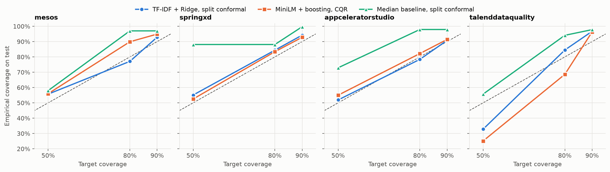

# EstiMate

**Story point estimation with calibrated uncertainty.** EstiMate reads the text of a backlog issue (title and description) and predicts its story points. Along with the single number it gives a range with a target coverage (50, 80 or 90%), built with split conformal prediction and checked on issues the model never saw.

**Live demo:** https://aishayest.github.io/EstiMate/ · **How it works:** https://aishayest.github.io/EstiMate/method.html

The aim was an honest experiment rather than record accuracy:
- issues are split by time, not at random;
- nothing is fitted on data the model is evaluated on;
- the test set was opened once, at the end;
- the whole pipeline reproduces with one command.

---

## Results at a glance

Evaluated on the newest 20% of issues of four open-source projects (1,897 test issues), with 95% bootstrap confidence intervals.

**The range keeps its promise.** For a 90% target, the TF-IDF + Ridge model with split conformal intervals caught the real estimate **93.6%** of the time on average, with a mean width of **6.2 SP**.

| Project | Test issues | Coverage @ 90% [95% CI] | Mean width (SP) |
|---|---|---|---|
| Apache Mesos | 336 | 92.9% [89.9–95.5] | 3.43 |
| Spring XD | 706 | 94.2% [92.5–95.9] | 5.60 |
| Appcelerator Studio | 584 | 90.8% [88.4–93.0] | 4.70 |
| Talend Data Quality | 271 | 96.7% [94.5–98.5] | 11.25 |

**The exact number is hard.** Text alone carries little signal about effort. Compared with always predicting the training median, MAE improves by 6.7% on Mesos, 6.6% on Spring XD and 0.9% on Talend, and is 9.2% *worse* on Appcelerator Studio.

| Project | Median baseline | TF-IDF + Ridge [95% CI] | MiniLM + boosting |
|---|---|---|---|
| Apache Mesos | 1.220 | 1.138 [1.020–1.261] | 1.121 |
| Spring XD | 1.715 | 1.602 [1.509–1.706] | 1.629 |
| Appcelerator Studio | 1.301 | 1.420 [1.315–1.518] | 1.401 |
| Talend Data Quality | 3.314 | 3.285 [3.013–3.585] | 3.966 |

*(MAE in story points.)*

**Where the guarantee stops.** In Talend Data Quality the typical estimate fell from 5 SP (training period) to 2 SP (test period). Ranges calibrated on older issues sat too high: at the 50% level they covered only **32.8%** of later issues. The 90% range still held because it was wide enough. Conformal prediction guarantees coverage only while new issues are exchangeable with the calibration issues, and here they were not.



More figures: [interval width](results/figures/interval_width.png) · [coverage over time](results/figures/coverage_over_time.png) · [example intervals](results/figures/example_intervals.png).

---

## In practice: internship pilot

During my internship, a software team used EstiMate in sprint planning for **5 sprints**. The company is not named, and the team's tasks are confidential.

- **Setup.** The TF-IDF + Ridge model trained on open-source issues was used as is, with no retraining on the team's texts. Only the conformal calibration was redone, on the team's **120 most recent past tasks**. The team lead reviewed the suggested size and range during planning.
- **Scale.** **145 tasks** went through the tool.
- **Coverage.** At a 90% target, the team's final estimate fell inside the range for **84%** of tasks (122 of 145; 95% Wilson CI 77–89%). This is below target, which is consistent with the main finding above: the guarantee holds only while new tasks resemble the calibration set. Mean range width was **4.5 SP**.
- **Hidden epics.** 21 tasks received an unusually wide range (over 6–8 SP). The lead flagged them in planning, and **16** turned out to be hidden epics that were split into smaller tasks before the sprint started.
- **Planning time.** For routine tasks the team relied more on the suggested size. By the team's estimate, this cut Planning Poker discussion time by about **15–20%**.

These numbers come from the internal pilot and cannot be reproduced from this repository. Every other number here is computed from the public Deep-SE data by the pipeline below.

---

## Method

**Data.** [Deep-SE](https://github.com/morakotch/datasets/tree/master/storypoint/IEEE%20TSE2018) (Choetkiertikul et al., 2018). It holds 23,313 Jira issues with story points from 16 open-source projects. Four projects from four organisations were selected (9,468 issues after cleaning): each has over 1,300 issues and a standard Fibonacci-like scale. Two projects with scales up to 100 SP were excluded. The dataset has no date column, but its rows are sorted by creation time, so **row order is the time axis**. Issue-key numbers are not used for ordering: they have inversions and, in one project, two interleaved key series.

**Protocol.**
- Within each project: oldest 60% train, next 20% validation, newest 20% test.
- Hyperparameters are tuned on validation only. TF-IDF vocabularies and all other fitted transforms see training data only.
- Interval methods were developed without touching test: fit on the oldest 75% of train, calibrate on the newest 25%, evaluate on validation.
- Final run: fit on train, calibrate on validation, evaluate on test, once. The methods were fixed before this run.

**Models.**
- Median baseline.
- TF-IDF + Ridge regression on a log target.
- Frozen `all-MiniLM-L6-v2` sentence embeddings (pinned revision, no fine-tuning) + histogram gradient boosting.

**Intervals.**
- Split conformal with absolute residuals (the method used on the site).
- A log-scale variant.
- Conformalized quantile regression (CQR).

Story points are integers, so interval bounds are rounded *inward* (`⌈lo⌉`, `⌊hi⌋`). For integer labels this leaves coverage unchanged and makes the range narrower.

**Web demo.** The site runs the same TF-IDF + Ridge model and the same conformal margins in the browser. `tests/web_parity.py` checks that the JavaScript port matches the Python predictions on all 1,897 test issues: every interval matches exactly, and point estimates agree to within 3·10⁻⁷.

---

## Reproduce

```bash
git clone https://github.com/Aishayest/EstiMate
cd EstiMate
python -m venv .venv
.venv/bin/pip install -r requirements.txt
.venv/bin/python -m src.pipeline      # ~10 min on a laptop CPU
```

The pipeline downloads the data (checked against SHA-256 checksums), tunes and evaluates every model, writes tables and figures to `results/`, and exports the files the website loads into `web/`. Random seeds are fixed, and repeated runs produce byte-identical results.

Other entry points:

```bash
.venv/bin/python tests/web_parity.py           # browser vs Python parity (needs node)
python3 -m http.server -d web 8000             # website locally
.venv/bin/streamlit run app/streamlit_app.py   # Streamlit demo
```

## Repository structure

```
src/        data loading, models, conformal intervals, evaluation, figures, web export
results/    CSV tables and PNG figures
web/        static website (deployed to GitHub Pages)
app/        Streamlit demo
tests/      browser/Python parity check
```

## Limitations

- Point accuracy from text alone is modest, and on one project the model is worse than the median baseline. The range is the useful output.
- Ranges for Talend Data Quality are wide (11.25 SP on average at 90%) and therefore of limited practical use.
- Validation MAE is slightly optimistic because hyperparameters were tuned on it. Test results are unaffected.
- Early in the project, the median story points of the test split were printed once by mistake while inspecting the splits. No model, method or hyperparameter decision used that output.
- Coverage guarantees assume exchangeability. Both the Talend test split and the internship pilot show what happens when estimates drift over time.

## Reference

M. Choetkiertikul, H. K. Dam, T. Tran, T. T. M. Pham, A. Ghose, T. Menzies. *A deep learning model for estimating story points.* IEEE Transactions on Software Engineering, 2018.
